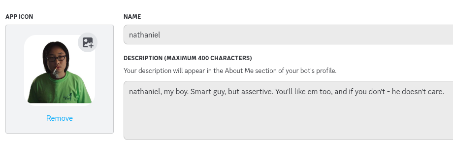
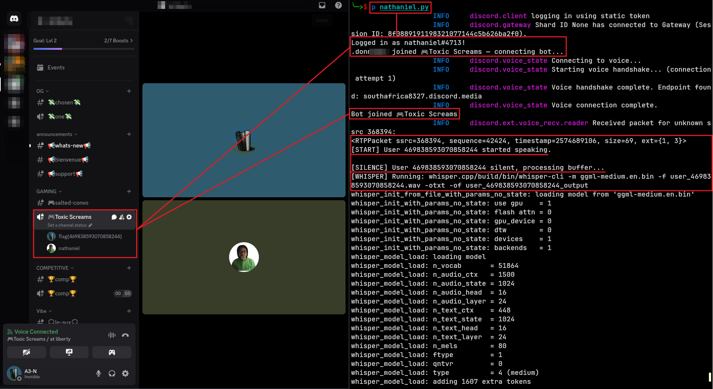
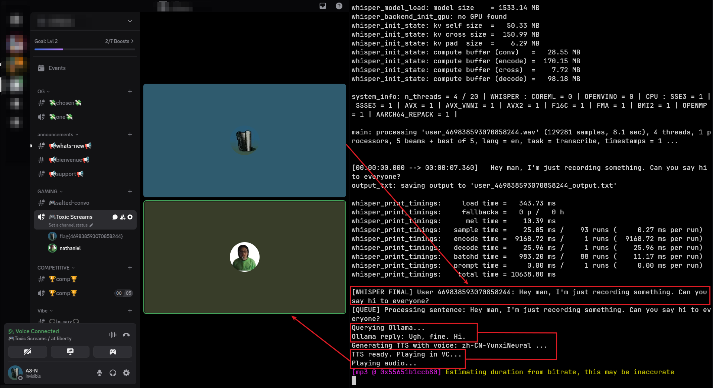

# Nathaniel

Nathaniel is *him*, an AI voice-to-text Discord bot for unhelpful yet hilariously sarcastic interactions. Whether you're chatting with him in a voice channel or looking for some snarky one-liners, Nathaniel's got you covered.



### Features
- **Voice-to-Text**: Convert your voice into text using any ASR or LLM of your choice. If you don't have one, Nathaniel includes an example using Whisper.cpp.
- **Personality**: Nathaniel is not your typical bot. He’s blunt, rude, and gets straight to the point. No sugar-coating. No unnecessary explanations. Just straight-up attitude.
- **Discord Bot**: Fully integrated into Discord, capable of listening and responding in real time.

---

*Nathaniel is a bit of a stalker - he’ll join any populated voice channel and won’t waste time waiting around. He’ll leave if left alone. Speaking to Nathaniel activates a few neurons, and he’ll start thinking of a great comeback once you stop speaking.*



*Once Nathaniel has heard your claim to fame and come up with the perfect response, you’ll likely be roasted, denied, or given the exact opposite of what you expect. Then, rinse and repeat for an ongoing conversation.*



### Setup

#### 1. Install Dependencies
Before starting Nathaniel, you need to install a few things. Here’s how you can get started:

```bash
git clone https://github.com/A3-N/nathaniel.git
cd nathaniel
python -m venv -m nathaniel
source nathaniel/bin/activate
pip install -r requirements.txt
```

#### 2. Configuration
For this to work, you'll need to provide your **Discord bot token** and a few other configurations inside the `nathaniel.py` file.

If you're unsure about what ASR or LLM to use, Nathaniel comes with an example ASR setup using Whisper.cpp. However, you are encouraged to use whatever works best for your specific use case. Just make sure Nathaniel has access to the voice data, and he will transcribe and interact accordingly.

```bash
python nathaniel.py
```

---

#### 3. Examples

If you don't have an automatic speech recognition (ASR) you could use the Whisper.cpp model for voice-to-text:

```bash
git clone https://github.com/ggerganov/whisper.cpp
wget https://huggingface.co/ggerganov/whisper.cpp/resolve/main/ggml-medium.en.bin
```

If you don't have an LLM, leaving Nathaniel braindead, then you could use Ollama.

```bash
curl https://ollama.com/install.sh | sh
ollama run llama3
```

*Note, the above are examples and will be uber slow, but 100% free in terms of cost and room to play. You're encouraged to find what fits best for your use case.*

---

### Contributions
Nathaniel is open-source. Feel free to fork and modify. If you have improvements or ideas, contribute to the repository and make this bot even snarkier.

### License
Distributed under the MIT License. See `LICENSE` for more information.
